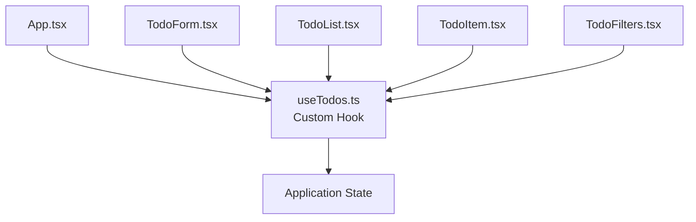

# 📝 Todo App — React + TypeScript + Vite


A **modern Todo application** built with **React, TypeScript, and Vite**, designed to showcase **clean frontend architecture, separation of concerns, and maintainable state management using custom hooks**.

This project demonstrates how to build a **scalable React application** with clear responsibilities between UI components and business logic.

> [!TIP]
> The main goal of this project is to illustrate **clean code practices in modern frontend development**, particularly the separation between **UI rendering and application logic** using a **custom hook (`useTodos`)**.

---

# 📚 Table of Contents

- [🚀 Features](#-features)
- [✨ Key Features Highlight](#-key-features-highlight)
- [🛠️ Tech Stack](#️-tech-stack)
- [⚡ Why Vite?](#-why-vite)
- [📦 Installation](#-installation)
- [📁 Project Structure](#-project-structure)
- [🧩 Architecture](#-architecture)
- [🧪 Code Quality](#-code-quality)
- [🤝 Contributing](#-contributing)
- [👨‍💻 Author](#-author)
- [📄 License](#-license)

---

# 🚀 Features

The application provides essential features for managing tasks efficiently.

| Feature | Description | Component |
|------|------|------|
| ➕ Add Todos | Add new tasks through a form | `TodoForm.tsx` |
| 📋 Display Todos | Dynamic rendering of todo list | `TodoList.tsx` |
| ✔️ Toggle Completion | Mark tasks as completed | `TodoItem.tsx` |
| ✏️ Edit Todos | Modify task text | `TodoItem.tsx` |
| ❌ Delete Todos | Remove tasks from the list | `TodoItem.tsx` |
| 🎯 Filtering | Filter by **All / Active / Completed** | `TodoFilters.tsx` |

> [!NOTE]
> The **business logic is completely isolated inside a custom hook (`useTodos`)**, ensuring a clean separation between **state management and UI rendering**.

---

# ✨ Key Features Highlight

## Custom Hook for Business Logic

A key design decision in this project is the use of a **custom React hook** to centralize the application's state and logic.

Instead of scattering state logic across components, everything lives in **`useTodos.ts`**.

### Example Concept

```ts
export type Todo = {
  id: number
  text: string
  completed: boolean
}

export function useTodos() {
  const [todos, setTodos] = useState<Todo[]>([])

  const addTodo = (text: string) => {
    const newTodo: Todo = {
      id: Date.now(),
      text,
      completed: false
    }

    setTodos(prev => [...prev, newTodo])
  }

  const toggleTodo = (id: number) => {
    setTodos(prev =>
      prev.map(todo =>
        todo.id === id
          ? { ...todo, completed: !todo.completed }
          : todo
      )
    )
  }

  return { todos, addTodo, toggleTodo }
}
````

### Benefits

| Advantage            | Explanation                              |
| -------------------- | ---------------------------------------- |
| 🧠 Centralized logic | All state logic lives in one place       |
| ♻️ Reusability       | The hook can be reused across components |
| 🧹 Cleaner UI        | Components focus only on rendering       |
| 🔒 Type Safety       | TypeScript ensures predictable state     |

---

# 🛠️ Tech Stack

| Technology     | Purpose                                        |
| -------------- | ---------------------------------------------- |
| **React**      | UI library for building interactive interfaces |
| **Vite**       | Lightning-fast development environment         |
| **TypeScript** | Static typing for safer and scalable code      |
| **ESLint**     | Enforces code quality and best practices       |

---

# ⚡ Why Vite?

[Vite](https://vitejs.dev/) was chosen as the build tool for several reasons:

| Feature                       | Benefit                                 |
| ----------------------------- | --------------------------------------- |
| ⚡ Instant dev server          | Near-instant startup time               |
| 🔥 HMR (Hot Module Reloading) | Real-time UI updates during development |
| 📦 Optimized builds           | Efficient production bundles            |
| 🧩 Native ES modules          | Modern browser-first architecture       |

> [!TIP]
> Vite dramatically improves **developer experience (DX)** by reducing build time and providing fast feedback during development.

---

# 📦 Installation

Follow these steps to run the project locally.

## 1️⃣ Clone the repository

```bash
git clone https://github.com/votre-username/todo-app.git
cd todo-app
```

---

## 2️⃣ Install dependencies

```bash
npm install
```

---

## 3️⃣ Start the development server

```bash
npm run dev
```

---

## 4️⃣ Open the application

Visit:

```
http://localhost:5173
```

---

# 📁 Project Structure

```
.
├── eslint.config.js
├── index.html
├── package.json
├── public
│   └── vite.svg
├── src
│   ├── App.tsx
│   ├── components
│   │   ├── TodoFilters.tsx
│   │   ├── TodoForm.tsx
│   │   ├── TodoItem.tsx
│   │   └── TodoList.tsx
│   ├── index.css
│   ├── main.tsx
│   ├── types.ts
│   └── useTodos.ts
├── tsconfig.json
└── vite.config.ts
```

---

# 📂 `src/` Overview

| File          | Responsibility                      |
| ------------- | ----------------------------------- |
| `main.tsx`    | React application entry point       |
| `App.tsx`     | Root component orchestrating the UI |
| `components/` | Reusable UI components              |
| `useTodos.ts` | Centralized business logic          |
| `types.ts`    | TypeScript definitions              |
| `index.css`   | Global styles                       |

---

# 🧩 Architecture

The application follows a **clean and predictable architecture** where UI components interact with a centralized business logic layer.



### Architecture Principles

| Principle              | Benefit                      |
| ---------------------- | ---------------------------- |
| Separation of Concerns | UI and logic are decoupled   |
| Reusable Logic         | Hooks can be reused          |
| Maintainability        | Easier to scale and maintain |
| Predictable State Flow | Single source of truth       |

---

# 🧪 Code Quality

The project integrates several tools to ensure **maintainable and reliable code**.

| Tool                         | Purpose                                |
| ---------------------------- | -------------------------------------- |
| **TypeScript (Strict Mode)** | Prevent runtime errors                 |
| **ESLint**                   | Detect bad practices and enforce style |
| **Modular Architecture**     | Improves scalability                   |

> [!NOTE]
> Combining **TypeScript + ESLint + modular architecture** significantly improves long-term maintainability.

---

# 🤝 Contributing

Contributions are welcome!

### Steps

1. **Fork the repository**

2. **Create a feature branch**

```bash
git checkout -b feature/my-feature
```

3. **Commit your changes**

```bash
git commit -m "feat: add new feature"
```

4. **Push the branch**

```bash
git push origin feature/my-feature
```

5. **Open a Pull Request**

> [!TIP]
> Please ensure your code follows **TypeScript and ESLint rules** before submitting a PR.

---

# 👨‍💻 Author

This project was created as a demonstration of:

* **Modern React architecture**
* **Custom hooks for business logic**
* **Clean and maintainable TypeScript code**
* **Developer Experience best practices**

---

# 📄 License

This project is distributed under the **MIT License**.
